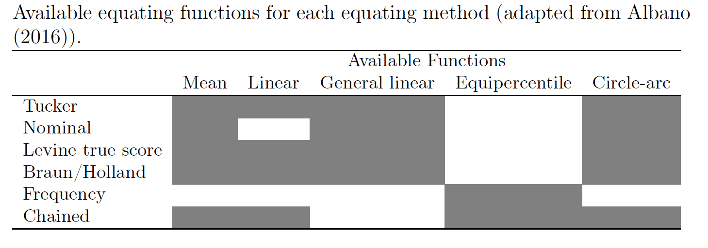

```{r setup, include=FALSE}
knitr::opts_chunk$set(message=FALSE, warning=FALSE)
library("equate")
```
<br>

# Equivalent (Random) Groups

In an equivalent group design, a random sample of examinees takes form X and a second random sample takes form Y. Because these are random samples from the same population, any differences in the distribution of scores are again assumed to be a function of test difficulty because the randomization should ensure that the two groups are equivalent in the ability being assessed.

## Example Setup

First, we will install and activate the **equate** package. 

```{r ch1, eval=FALSE}
install.packages("equate")
library("equate")
```

Next, we will import the test forms (X and Y) into R. Each form has 1000 students taking either form X or form Y. Scores in both forms range from 20 to 50 points. In this example, assume that X is the new test form and Y is the reference test form. We want to place scores from form X into the scale of form Y. 

```{r ch2}
# Test form X
formx <- read.csv("formx.csv", header = TRUE)
formy <- read.csv("formy.csv", header = TRUE)

# Preview the data sets
head(formx)
head(formy)

# Combine the forms
formxy <- rbind(formx, formy)
```

The **equate** package analyzes score distributions as frequency tables. These frequency tables are created using the `as.freqtab` function in **equate**. So, our data must be restructured as a frequency table in order to work with the functions in **equate**.

```{r ch3}
# Add score frequencies to the data
data <- as.data.frame(table(formxy$score, formxy$form))
names(data) <- c("total", "form", "count")
head(data)

# Restructure the data as a frequency table
data_x <- as.freqtab(data[data$form == "x", c("total", "count")], scales = 20:50)
data_y <- as.freqtab(data[data$form == "y", c("total", "count")], scales = 20:50)

head(data_x)
head(data_y)
```

Now let's see a descriptive summary of the forms.

```{r ch4}
# Descriptive summary of the forms
rbind(form_x = summary(data_x), form_y = summary(data_y))
```

We can also visualize the test score distributions.

```{r ch5}
plot(data_x, main = "Bar plot of the test scores on form X")
```

```{r ch6}
plot(data_y, main = "Bar plot of the test scores on form Y")
```

## Linear Equating Methods

The linear equating methods include identity (i.e., no equating), mean, linear, and general linear functions. 

### Mean Equating

This method adjusts the scores from the new form (X) using the mean difference between the two forms (X and Y) as a fixed constant. 

```{r ch7}
mean_yx <- equate(data_x, data_y, type = "mean")
mean_yx
```

We can also check out the concordance table to see how X scores changed after being equated to form Y. The concordance table indicates that an examinee who got a 20 on form X would be expected to get a 23.92 on form Y. That is, it is a simple transformation of form X + 3.915.

```{r ch8}
head(mean_yx$concordance)
```

We can merge the concordance table back to form X so that we can see both old and new scores together for each examinee. 

```{r ch9}
# Save the concordance table
form_yx <- mean_yx$concordance

# Rename the first column to total
colnames(form_yx)[1] <- "total"

# Merge the concordance table to form x
data_xy <- merge(data_x, form_yx)
head(data_xy)
```

### Linear Equating

This method adjusts the scores from the new form (X) using both the mean and standard deviation differences between the two forms (X and Y) using a linear equation. 

```{r ch10}
linear_yx <- equate(data_x, data_y, type = "linear")
linear_yx
```

We can check out the equated scores against the original scores as follows:

```{r ch10a}
plot(linear_yx)
```

We can also run a bootstrap for the equating process and create a standard error plot:

```{r ch10b}
linear_yx_boot <- equate(data_x, data_y, type = "linear", boot = TRUE, reps = 5)
plot(linear_yx_boot, out = "se", legendplace = "topright")
```

## Non-Linear Equating

The nonlinear equating methods include equipercentile, circle-arc, and composite functions.

### Equipercentile Equating

Equipercentile equating works by breaking up the scores on the X and Y forms into percentiles. Then percentiles of form X are matched to the percentiles on form Y.

```{r ch11}
equi_yx <- equate(data_x, data_y, type = "equipercentile")
```

Now, let's see how the X scores have been adjusted based on the percentile ranks of forms X and Y. The following figure shows that the biggest discrepancies between these two functions are at the tails of the distribution.

```{r ch12}
plot(equi_yx$concordance$yx ~ equi_yx$concordance$scale, type = "p", xlab = "Form X scores", 
     ylab = "Adjusted X Scores on Form Y", ylim = c(20, 55))
points(linear_yx$concordance$yx ~ linear_yx$concordance$scale, pch = 4)
```

We can also add loglinear smoothing into the process and compare it against the regular equipercentile. The smooth line indicates the equipercentile with loglinear smoothing whereas the straight line (with a breaking point) indicates the regular equipercentile.

```{r ch11a}
equismooth_yx <- equate(data_x, data_y, type = "equipercentile", smooth = "loglin", degree = 3)

# Compare equating functions
plot(equi_yx, equismooth_yx, addident = FALSE)
```


# Nonequivalent Groups

In a nonequivalent group design, the population of examinees taking the different forms cannot be assumed to be from the same population. Therefore, potential differences in their abilities on the construct(s) must be accounted for. When a nonequivalent group design is used, a particular equating method must be specified. Generally, these methods work by relating the total scores on form X and form Y through the scores on a common set of items appearing on both forms (i.e., the common anchor scores) and the creation of a weighted, synthetic population (see [Albano (2016)](https://www.researchgate.net/publication/309364327_equate_An_R_Package_for_Observed-Score_Linking_and_Equating) for more information on these methods). The equating methods available in the **equate** package are:

* Tucker
* Nominal
* Levine true score
* Braun/Holland
* Frequency
* Chained

The following table shows the combinations of these methods with the other equating types that we have seen so far:



## Example Setup

The negd data set contains data on 2,000 examinees responding to 35 questions on a particular form of the test (either form X or form Y). Questions 1 through 25, labeled q.1, ..., q.25, are unique to each form, while questions 26 through 35, labeled a.1, ..., a.10, are the common anchor items.

```{r ch13}
negd <- read.csv("negd.csv", header = TRUE)
head(negd)
```

Because the data are in a person-by-item format, for each person, we need to calculate their total score on the form, excluding the common anchor items, then their score on the common anchor items. Once this is done, frequency tables can be created, plotted, and then passed onto the **equate** function.

```{r ch14}
# Calculate total scores based on unique items
negd$total <- rowSums(negd[, 1:25])

# Calculate scores based on anchor items
negd$anchor <- rowSums(negd[, 26:35])

# Create frequency tables (total score range: 0-25; anchor score range: 0-10)
negd_x <- freqtab(negd[1:1000, c("total", "anchor")], scales = list(0:25, 0:10))
negd_y <- freqtab(negd[1001:2000, c("total", "anchor")], scales = list(0:25, 0:10))
```

Now we will see a scatterplot of the common anchor scores on form X against the total scores on form X. Plotted along the axes are the marginal distributions of these scores.

```{r ch15}
plot(negd_x, xlab = "Total Scores Form X", ylab = "Common Anchor Scores Form X")
```

The two distributions are roughly normal, with some irregularities for the total scores for form X (note the presence of various peaks near the center of this distribution). Because there are irregularities, assumed to arise from measurement error, presmoothing could be performed. There are a variety of presmoothing options available in equate. One option involves fitting a log linear model. Log linear presmoothing can be specified for forms X and Y as follows:

```{r ch16}
smooth_x <- presmoothing(negd_x, smoothmethod = "loglinear")
smooth_y <- presmoothing(negd_y, smoothmethod = "loglinear")
```

Now, let's check out the plot again. 

```{r ch17}
plot(smooth_x, xlab = "Total Scores Form X", ylab = "Common Anchor Scores Form X")
```

## Linear Tucker Equating

Now we will use linear equating based on the Tucker method. 

```{r ch18}
negd_tucker <- equate(negd_x, negd_y, type = "linear", method = "tucker")
negd_tucker$concordance
```

## Comparing Multiple Methods

```{r ch19}
# Nominal method with mean equating
negd_nom <- equate(negd_x, negd_y, type = "mean", method = "nom")

# Frequency method with equipercentile
negd_freq <- equate(negd_x, negd_y, type = "equip", method = "freq")

# Braun method with linear equating
negd_braun <- equate(negd_x, negd_y, type = "linear", method = "braun")

# Compare equated scores
round(cbind(xscale = 0:25, 
            nominal = negd_nom$concordance$yx,
            tucker = negd_tucker$concordance$yx, 
            freq = negd_freq$concordance$yx, 
            braun = negd_braun$concordance$yx), 2)

# Plot the results
plot(negd_tucker, negd_nom, negd_freq, negd_braun, lty=c(1,2,3,4),
     col=c("blue", "black", "red", "forestgreen"), addident = FALSE)
```
