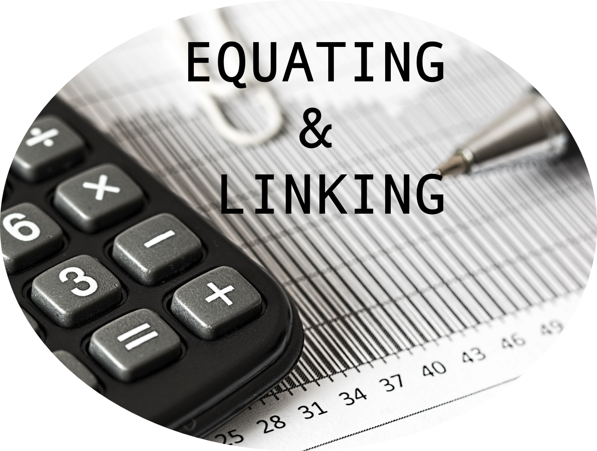

 

 
 

**Test equating** refers to statistical procedures to establish comparable scores on different forms of a test, allowing test scores from each form to be used interchangeably. It allows test administrators to establish validity of test results across different forms and years. This online resource aims to present practical applications of test equating in R by drawing upon information from a variety of resources about test equating, linking, and scaling. Well-known test equating methods in Classical Test Theory (CTT) and Item Response Theory (IRT) are demonstrated using various examples in R. A zipped folder including the R codes and datasets used in the examples can be downloaded **[here](https://github.com/okanbulut/equating/raw/main/codes_data/codes_data.zip)**. 
 
 

## A List of (Some) R Packages for Test Equating

* [equate](https://cran.r-project.org/web/packages/equate/index.html) (CTT)
* [SNSequate](https://cran.r-project.org/web/packages/SNSequate/index.html) (CTT, IRT)
* [equi](https://github.com/twolodzko/equi/) (CTT)
* [plink](https://cran.r-project.org/web/packages/plink/) (IRT)
* [equateIRT](https://cran.r-project.org/web/packages/equateIRT/index.html) (IRT)
* [equateMultiple](https://cran.r-project.org/web/packages/equateMultiple/index.html) (IRT)

**Note:** CTT: Classical Test Theory; IRT: Item Response Theory.
 
 

## Additional Resources

* Michael Kolen and Robert Brennan's seminal book on equating: [Test Equating, Scaling, and Linking: Methods and Practices](https://www.springer.com/gp/book/9781493903160)

* Jorge González and Marie Wiberg's [Applying Test Equating Methods](https://www.springer.com/gp/book/9783319518220)

* Christopher Desjardins and Okan Bulut's [Handbook of Educational Measurement and Psychometrics Using R](https://www.routledge.com/Handbook-of-Educational-Measurement-and-Psychometrics-Using/Desjardins-Bulut/p/book/9780367734671)

* CCSSO's guidelines on equating: [A Practitioners' Introduction to Equating](https://files.eric.ed.gov/fulltext/ED544690.pdf) 

* Anthony Albano's [vignette](https://cran.r-project.org/web/packages/equate/vignettes/equate-jss.pdf) for the **equate** package

* Jonathan Week's [vignette](https://cran.r-project.org/web/packages/plink/vignettes/plink-UD.pdf) for the **plink** package

* Michela Battauz's [article](https://www.jstatsoft.org/article/view/v068i07/v68i07.pdf) on the **equateIRT** package

***

**Note:** This online resource has been prepared by [Dr. Okan Bulut](https://sites.google.com/ualberta.ca/okanbulut/). For questions and comments, please contact Dr. Okan Bulut via email: <bulut@ualberta.ca> 

